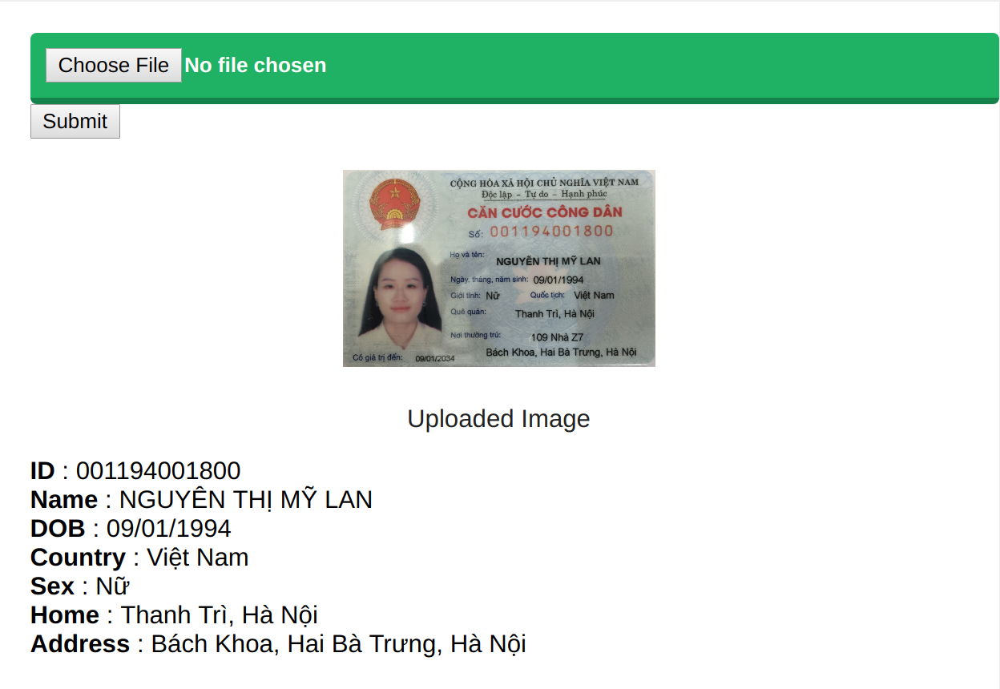

# flask-id-scanner


This is an web application written in Flask and Tensorflow to scan information from Vietnamese's newest ID Card.

**Special thanks to https://github.com/eragonruan/text-detection-ctpn and Tesseract**


***
# setup
Build the cython library
```shell
cd utils/bbox
chmod +x make.sh
./make.sh
```
***
# Running
- Follow setup to build the library 
- download the ckpt file from [google drive](https://drive.google.com/file/d/1HcZuB_MHqsKhKEKpfF1pEU85CYy4OlWO/view?usp=sharing)
- put checkpoints_mlt/ in flask-id-scanner/
- Install missing dependencies by yourself.
- On the main folder, run this command

```shell
python web.py
```


- I have prepared some image in /data/demo for testing.


***
# Demo result


